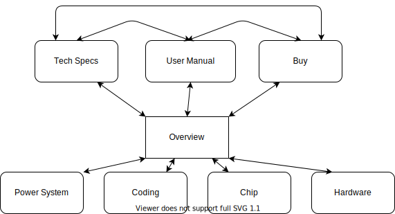
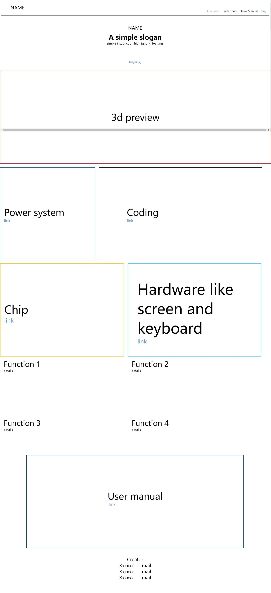
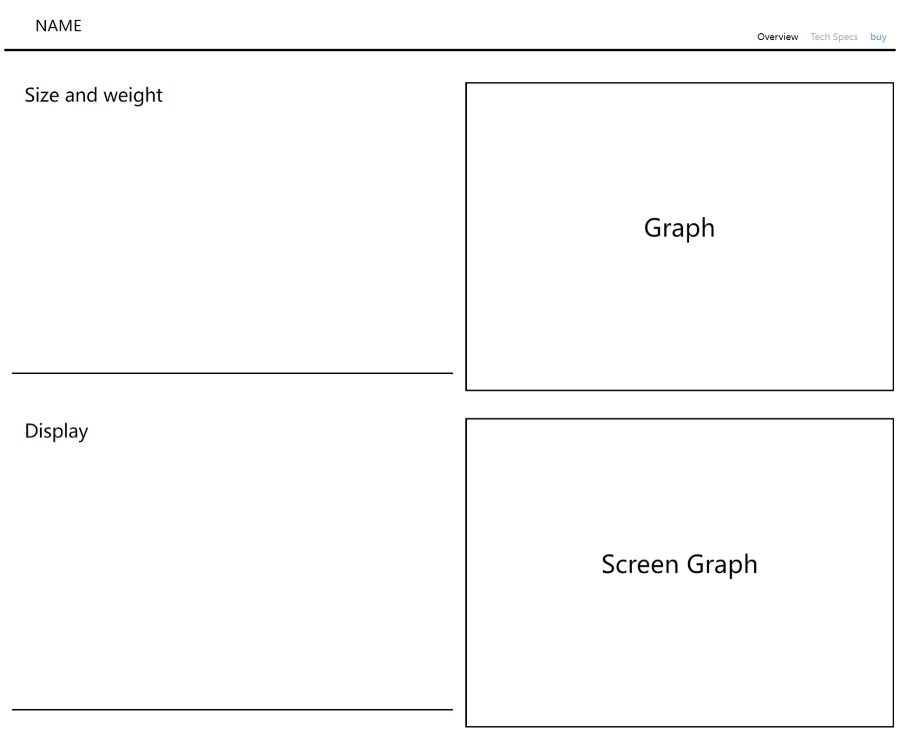
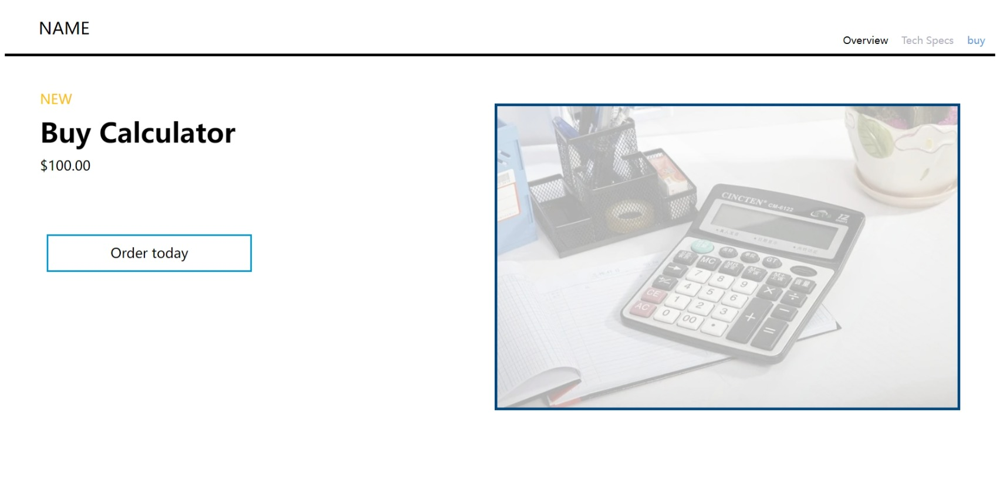
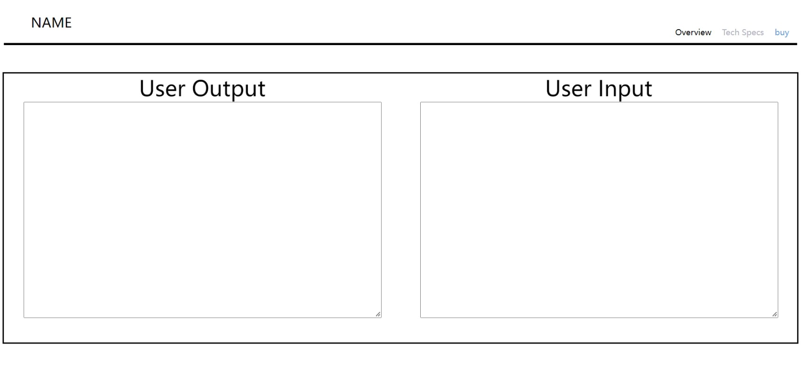

# Website

At present, the work of the website is mainly divided into two parts, one part is composed of multiple html pages, and the other part is to allow the python program to be demonstrated and run on the website.

- [Website Outline](###Website-Outline)
- [Calculator DEMO](##Calculator-DEMO)

## Website Outline

The website is characterized by simplicity and emphasis. It has a homepage and seven subpages. The homepage has a 3d model and scroll animation to express the most important features of the product. Each subpage has its own functionality, enabling features such as detailed introductions, product demos, and purchases.

The Menu Tree

The Main Page

Tech Specs Subpage

Buy Subpage

User Manual Subpage

### Calculator DEMO
In order to demonstrate the calculator program in python language directly on the website, I need to put the calculator program on the server first, and then add a flask framework to the program, so that the webpage can directly use the python program, and then use the ajax technology to make the input and The output can be smoothly transmitted between the web page and the program, and finally add an input window and an output window on the web page with javascript.